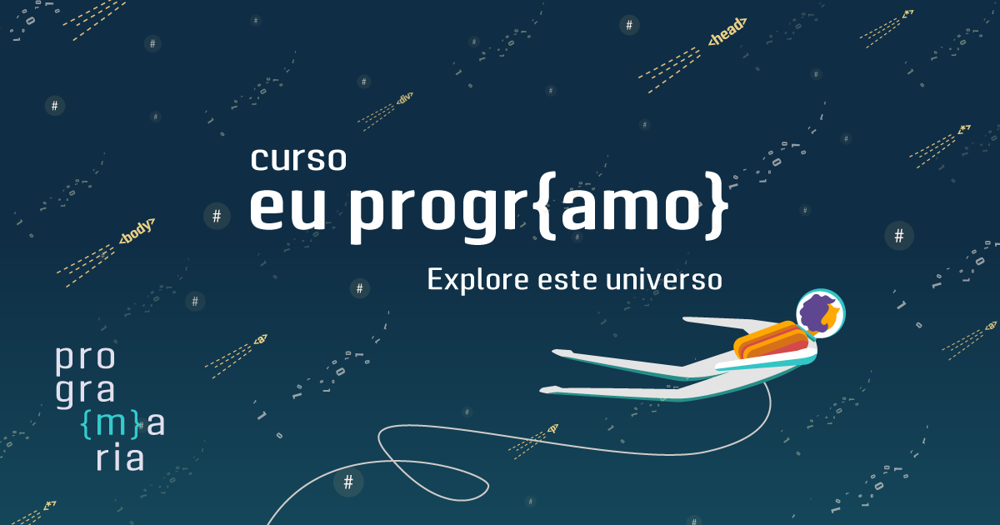
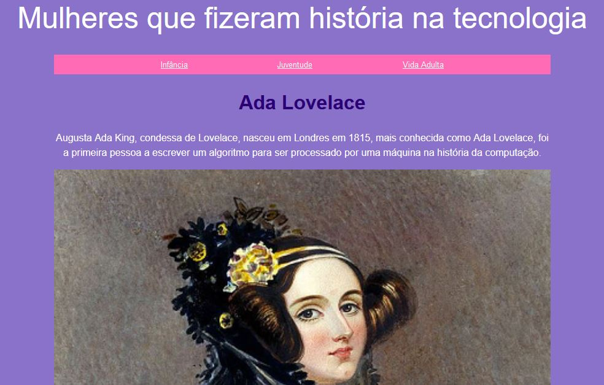

<h1 align="center">
    Curso EuProgr{amo} - Programaria
</h1>

    

 

## Tecnologias utilizadas
  - 
  - 
  -  

## Projeto
Este foi o meu primeiro projeto, um página web estática, quando participei da 6º turma do curso <a href="https://www.programaria.org/curso-online-euprogramo/" target="_blank">eu progr{amo}</a>, um curso voltado para mulheres aprenderem os princípios de desenvolvimento web.

 

    

## Como executa-lo?
Você pode vê-lo <a href="https://siteada.palomasouza1.repl.co" target="_blank">aqui</a>

## Status
Finalizado ✅
